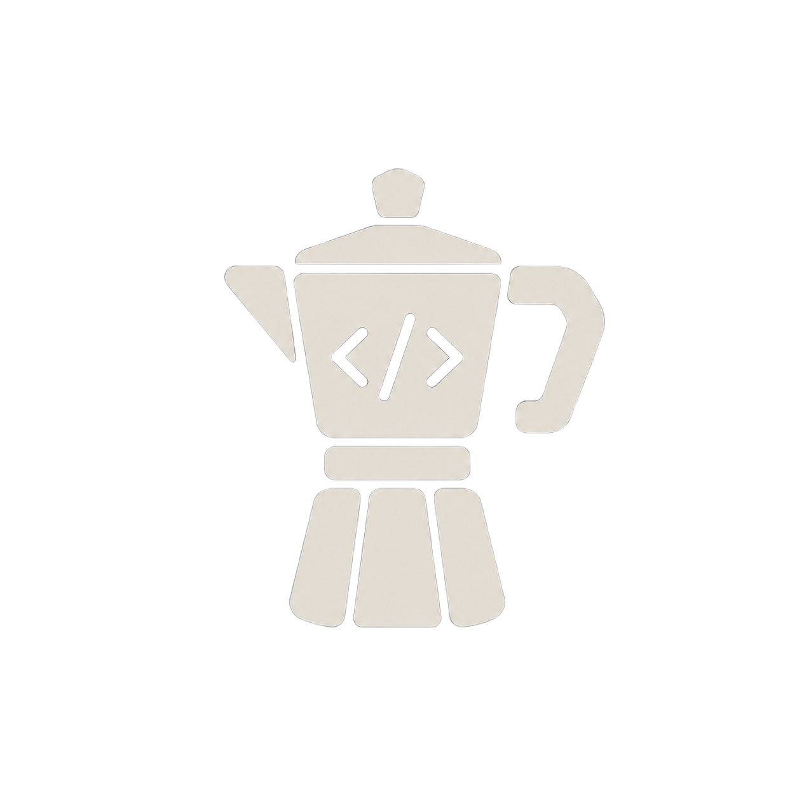

<p align="center">
  
</p>

<h1 align="center">CoffeeCode</h1>

<p align="center">
  Un IDE ligero y completamente personalizable, escrito en C con SDL3.
</p>

<p align="center">
  
  
  
  <a href="LICENSE"></a>
</p>

---

**CoffeeCode** busca crear un IDE completamente personalizable en el que el programador pueda crear la experiencia más agradable y comprometida para desarrollar nuevos productos tecnológicos. Está escrito en su mayor parte en **C**, usando la librería gráfica **SDL3** para la interfaz.

## Características

- Resaltado de sintaxis para C
- Pestañas con varios archivos abiertos a la vez
- Deshacer / rehacer (undo/redo)
- Explorador de archivos integrado
- Multiplataforma: Windows y Linux

## Compilación

Guía completa en **[doc/how_build.md](doc/how_build.md)**.

- **Windows:** `Compile.bat release` &nbsp;(o `debug` / `native` / `asan` / `clean`)
- **Linux:** `cmake -B build -DCMAKE_BUILD_TYPE=Release && cmake --build build -j`

## Documentación

| Documento | Contenido |
|-----------|-----------|
| [Cómo compilar](doc/how_build.md) | Requisitos y compilación en Windows / Linux |
| [Roadmap](doc/roadmap.md) | Futuras características planificadas |
| [Bugs conocidos](doc/known_issues.md) | Problemas pendientes de corregir |
| [Contribuir](CONTRIBUTING.md) | Flujo de ramas, formato de commits y pull requests |

## Atajos de teclado

| Atajo           | Acción                    |
|-----------------|---------------------------|
| Flechas         | Mover cursor              |
| Inicio / Fin    | Inicio / fin de línea     |
| Re Pág / Av Pág | Scroll rápido             |
| Ctrl+Inicio     | Ir al inicio del archivo  |
| Ctrl+Fin        | Ir al final del archivo   |
| Tab             | Indentar (4 espacios)     |
| Enter           | Nueva línea + autoindent  |
| Backspace       | Borrar antes del cursor   |
| Supr            | Borrar después del cursor |
| Ctrl+S          | Guardar                   |
| Ctrl+Q          | Salir                     |
| Rueda ratón     | Scroll vertical           |
| Click           | Mover cursor              |

## Estructura del proyecto

```text
CoffeeCode/
├-- CMakeLists.txt
├-- Compile.bat            ← build en Windows (modos release/debug/native/asan/clean)
├-- assets/                ← logo, icono y fuente (font.ttf se carga en runtime)
├-- include/<modulo>/      ← cabeceras (una carpeta por modulo)
└-- src/<modulo>/          ← fuentes  (una carpeta por modulo)
```

> La fuente se lee de `font.ttf` en runtime (junto al ejecutable, o vía la
> variable de entorno `COFFEECODE_FONT`); ya no va embebida en el binario.

Módulos: `buffer` (gap buffer de texto), `editor` (núcleo: pestañas, undo/redo), `lexer` (resaltado), `filetree` (explorador), `input` (entrada) y `render` (renderizador). Los includes de módulo usan prefijo de carpeta, p. ej. `#include "editor/editor.h"`.

## Licencia

Uso no comercial, con atribución y propiedad derivada. Consulta [LICENSE](LICENSE). &copy; 2026 Koan (Diego).
